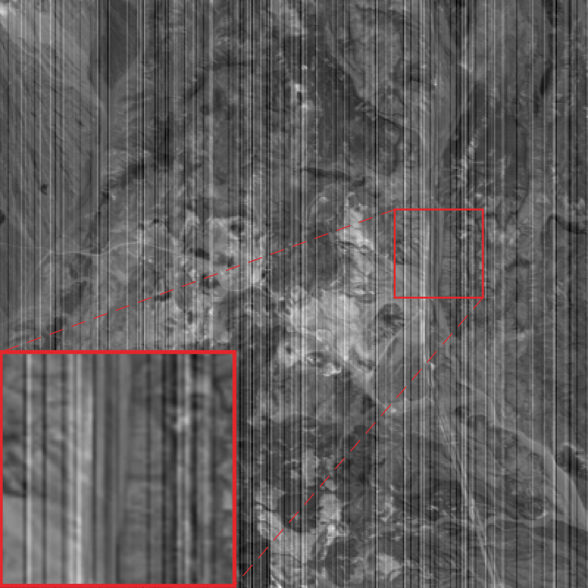
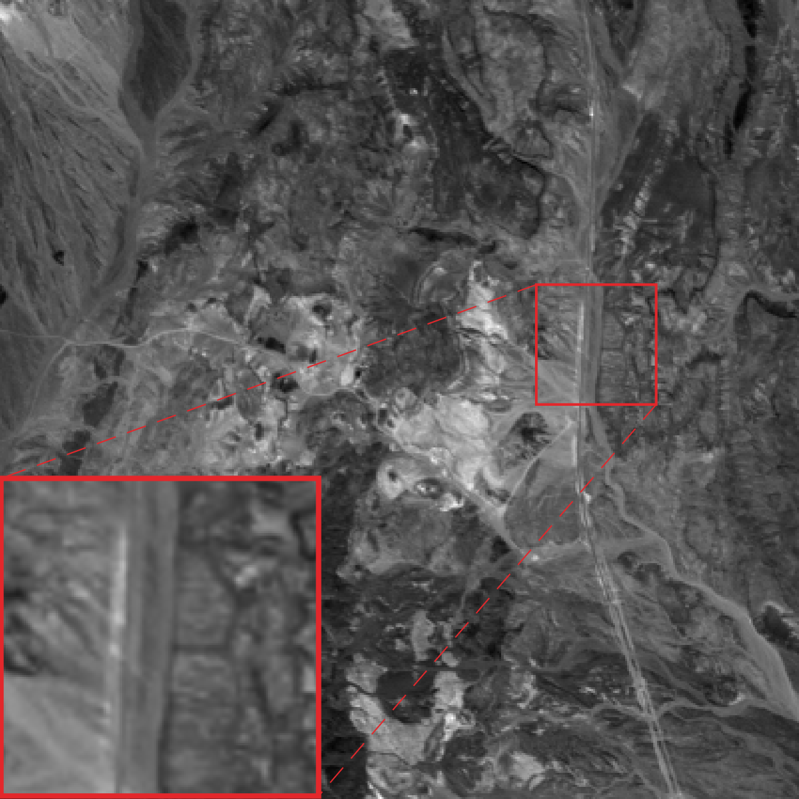
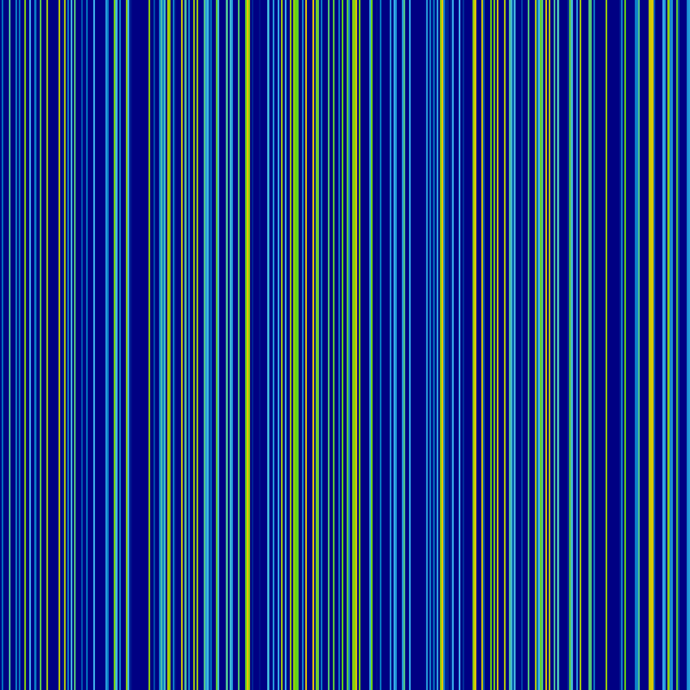
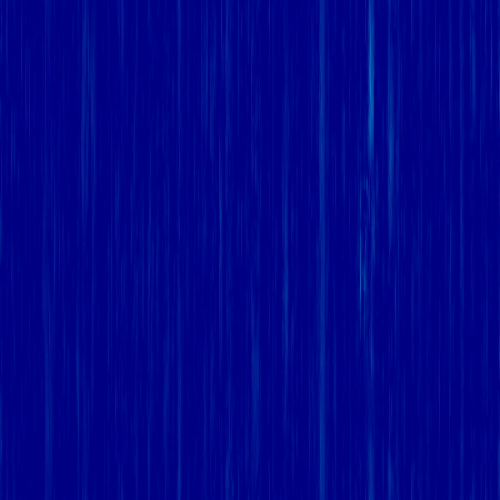

# [ADOM: ADMM-Based Optimization Model for Stripe Noise Removal in Remote Sensing Image](https://ieeexplore.ieee.org/abstract/document/10262317)
**Namwon Kim, Seong-Soo Han, and Chang-sung Jeong**
<br/>
IEEE Access, 2023
<br/>
[Manuscript](https://ieeexplore.ieee.org/abstract/document/10262317)

<br/> This is the official code for the paper ADOM: ADMM-Based Optimization Model for Stripe Noise Removal in Remote Sensing Image (accepted to IEEE Access 2023). <br/>

<br/>This MATLAB code serves as a demo of the ADOM in our manuscript, offering a clear and organized workflow for stripe noise removal in remote sensing images (RSI).<br/>

<table>
  <tr>
    <td>
    <p>Clean RSI</p>
    </td>
    <td>
    <p>Noisy</p>
    </td>
    <td>
    <p>Destriping result (ADOM)</p>
    </td>
    <td>
    <p>Error map (Clean)</p>
    </td>
    <td>
    <p>Error map (Noisy)</p>
    </td>
    <td>
    <p>Error map (ADOM)</p>
    </td>
  </tr>
</table>

# Abstract
Remote sensing images (RSI) are useful for various tasks such as Earth observation and climate change. However, RSI may suffer from stripe noise due to physical limitations in sensor systems. Therefore, image destriping is essential, since stripe noise may cause serious problems in real applications. In this paper, we shall present a new Alternating Direction method of multipliers (ADMM)-based Optimization Model, called ADOM for stripe noise removal in RSI. First, we formulate an optimization function for finding stripe noise components from the observed image for stripe noise removal, and then optimization process for solving the optimization function in order to extract stripe noise component. In the optimization process, we shall propose a weight-based detection strategy for efficient stripe noise component capture, and an ADMM-based acceleration strategy for fast stripe noise removal. In the weight-based detection strategy, we effectively detect stripe noise similar to the image details by using weighted norm generated by adjusting norm and group norm weights based on the momentum coefficient and residual parameter. In the ADMM-based acceleration strategy, we accelerate optimization process by using two control strategies: evidence-based starting point control and momentum-based step-size control. The former provides a starting point for more accurately finding stripe noise component, and the latter accelerates convergence by using the momentum coefficient while providing optimization stability by exploiting the damping coefficient. Our experimental results show that ADOM achieves better performance for both of simulated and real image data sets compared to the other destriping models.


# Requirements
[MATLAB](https://www.mathworks.com/)


# Running
To run the simulation_test.m script in MATLAB, simply execute the following command:
```matlab
run simulation_test.m
```

<br/>This command will initiate the simulation specified in the simulation_test.m script and execute the code within that file. Make sure you are in the correct directory or provide the full file path if simulation_test.m is not in your current working directory.


# Citation

Please cite our paper in your manuscript if it helps your research.

Bibtex:

```latex
@article{kim2023adom,
  title={{ADOM}: {ADMM}-Based Optimization Model for Stripe Noise Removal in Remote Sensing Image},
  author={Kim, Namwon and Han, Seong-Soo and Jeong, Chang-Sung},
  journal={IEEE Access},
  volume={11},
  pages={106{587}--106{606}},
  year={2023},
  publisher={IEEE}
}
```
